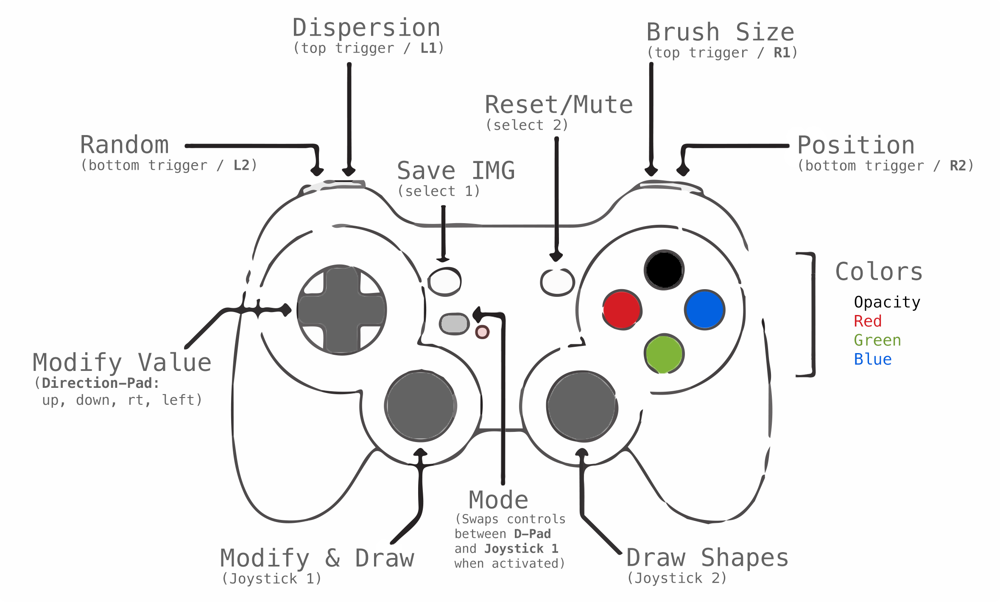

# Gamepad Gaussians

GAMEPAD GAUSSIANS is an interactive media project that blends color theory, mathematics and gaming into an experimental drawing environment. 

The program uses a Playstation-style gamepad to control parameters such as color, transparency, size, and dispersion.

## Setup

### Requirements
- Processing 3 (processing.org)
- USB game controller

### Getting Started
- Clone repo, should work out of the box

## How to play
- Video link, https://vimeo.com/205996679

### Acknowledgments
- JBJ, Rebholz, A. White, GP lib creator
