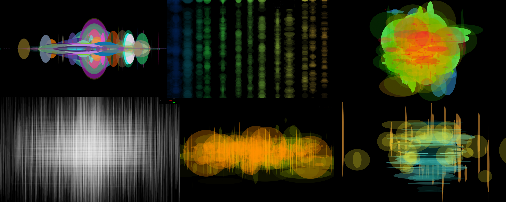

# Gamepad Gaussians

GAMEPAD GAUSSIANS is an interactive media project that blends color theory, mathematics and gaming into an experimental drawing environment. 

The program uses a Playstation-style gamepad to control parameters such as color, transparency, size, and dispersion.

## Setup

### Requirements
- USB game controller

### Getting Started
- [Download the game](https://m-ezekiel.itch.io/gamepad-gaussians?secret=Chu1XE4238kxY8nLetH2G4bd0cQ), or...
- Install [Processing](http://processing.org) and the [Game Control Plus library](http://lagers.org.uk/gamecontrol/)
- Clone the repo and build

## How to play
- Video link, https://vimeo.com/205996679

### Acknowledgments
- JBJ, Rebholz, A. White, Peter Lager (GCP library creator)
